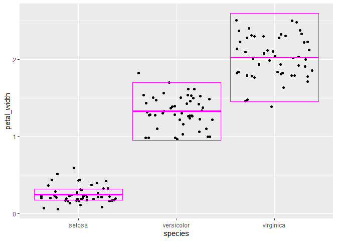
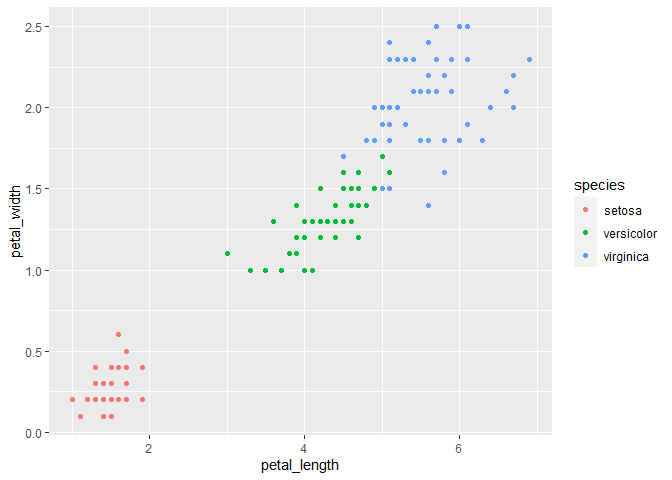

Lab 5
================
Dontae Johnson
2021-02-23

``` r
library(tidyverse)
iris <- as_tibble(iris)
```

``` r
Q1 <-
  rename(
    iris,
    sepal_length = Sepal.Length,
    sepal_width = Sepal.Width,
    petal_length = Petal.Length,
    petal_width = Petal.Width,
    species = Species
  )
Q1
```

    ## # A tibble: 150 x 5
    ##    sepal_length sepal_width petal_length petal_width species
    ##           <dbl>       <dbl>        <dbl>       <dbl> <fct>  
    ##  1          5.1         3.5          1.4         0.2 setosa 
    ##  2          4.9         3            1.4         0.2 setosa 
    ##  3          4.7         3.2          1.3         0.2 setosa 
    ##  4          4.6         3.1          1.5         0.2 setosa 
    ##  5          5           3.6          1.4         0.2 setosa 
    ##  6          5.4         3.9          1.7         0.4 setosa 
    ##  7          4.6         3.4          1.4         0.3 setosa 
    ##  8          5           3.4          1.5         0.2 setosa 
    ##  9          4.4         2.9          1.4         0.2 setosa 
    ## 10          4.9         3.1          1.5         0.1 setosa 
    ## # ... with 140 more rows

``` r
Q2 <-
  mutate(
    Q1,
    sepal_length_cm = sepal_length * 10,
    sepal_width_cm = sepal_width * 10,
    petal_length_cm = petal_length * 10,
    petal_width_cm = petal_width * 10
  )
```

``` r
Q3 <-
  mutate(Q1,
         sepal_area = sepal_length * sepal_width,
         petal_area = petal_length * petal_width)
Q3.5 <- select(Q3, sepal_area, petal_area)
```

``` r
summarize(
Q2,
sepal_count=length(sepal_length),
max=max(sepal_length),
min=min(sepal_length),
max-min(sepal_length),
sepal_median=median(sepal_length),
quantile(sepal_length,probs=0.25),
quantile(sepal_length,probs=0.75),
sepal_iqr=IQR(sepal_length))
```

    ## # A tibble: 1 x 8
    ##   sepal_count   max   min `max - min(sepa~ sepal_median `quantile(sepal~
    ##         <int> <dbl> <dbl>            <dbl>        <dbl>            <dbl>
    ## 1         150   7.9   4.3              3.6          5.8              5.1
    ## # ... with 2 more variables: `quantile(sepal_length, probs = 0.75)` <dbl>,
    ## #   sepal_iqr <dbl>

``` r
Q5<-
 Q2%>%
 group_by(species)%>%
 summarize(
  petal_count=length(petal_width),
  petal_mean=mean(petal_width),
  petal_devation=sd(petal_width),
  petal_variance=var(petal_width), 
  petal_sem=mean(petal_width)/sqrt(n()),
  petal_ci_upper=petal_mean + 2 * petal_sem,
  petal_ci_lower=petal_mean - 2 * petal_sem
  )
```

    ## `summarise()` ungrouping output (override with `.groups` argument)

``` r
#this is for 6 and 7
ggplot(data=Q2) +
  geom_jitter(mapping = aes(x=species,y=petal_width)) +
  geom_crossbar(data=Q5,
  mapping=aes(x=species, y = petal_mean, ymax = petal_ci_upper, ymin = petal_ci_lower),
  color = "magenta"
  )
```

<!-- -->

``` r
Q8<-select(Q2,petal_length,petal_width,species)
ggplot(data = Q8) +
  geom_point(mapping = aes(x=petal_length, y=petal_width, color=species))
```

<!-- -->
